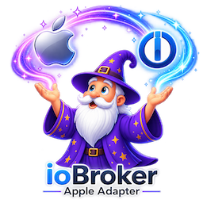

# ioBroker.apple



`iobroker.apple` discovers and controls supported Apple media devices in the
local network. Version 0.2 is the current development baseline. It contains an
Apple TV vertical slice and a conservative HomePod preview for public hardware
testing. Its object contracts are designed for ioBroker automations and
visualizations without exposing Apple protocol details.

## Current development scope

- discovery of Apple TVs through AirPlay, Companion Link, and RAOP DNS-SD
  services;
- stable identity derived from protocol identifiers, never from a name or IP
  address;
- PIN pairing from the ioBroker Admin page;
- encrypted, instance-scoped, owner-only pairing credential persistence;
- automatic reconnect attempts after periodic re-discovery;
- pushed connection, power, Now Playing, playback, app, and volume state;
- capability-gated navigation, Play/Pause, wake, and suspend controls;
- launchable application catalog with readable per-app start buttons and a
  capability-gated `apps.openurl` command for known universal or app links;
- tabbed Admin configuration for general settings, devices, and Apple Music;
- German/English adapter-configuration selection stored per instance;
- class-specific detected and managed device tables with active/passive
  selection, local removal, and no duplicate rows;
- separate discovery counts for Apple TV, HomePod, and generic AirPlay
  receivers, including current discovery names and models in Admin;
- strongly identified HomePod/HomePod mini objects with automatic transient
  pairing and no PIN or durable HomePod credentials;
- pushed HomePod connection, pairing phase, Now Playing, playback, and volume
  state plus capability-gated transport and writable volume controls;
- privacy-preserving HomePod debug diagnostics covering discovery, pairing,
  connection, capabilities, events, commands, errors, rediscovery, and unload;
- bounded discovery and complete adapter-unload cleanup.

HomePod control is an unverified development preview and is not part of the
released version 0.2 compatibility claim. Individual generic AirPlay-receiver
control, audio streaming, multi-room, Apple Music, and Alexa remain outside the
current scope.

## Open Points / Next Steps

The following work remains between the current version 0.2 vertical slice and
the intended first stable adapter release:

- **Complete Apple TV control:** add capability-gated seek/skip, writable
  volume, artwork, account selection, and audio-output discovery and selection.
- **Validate HomePod and add AirPlay receiver control:** run the HomePod preview
  against representative HomePod and HomePod mini hardware, record pairing,
  state, controls, recovery, restart, and unload results, and keep receivers
  without reliable identity discovery-only.
- **Implement media sources and playback:** support validated local files,
  URLs, web radio, and TTS where lawful playback and protocol support can be
  demonstrated. Define limits and cleanup for streams, temporary data, and
  external tools.
- **Evaluate optional external media providers:** use separate provider modules
  for searchable channel and content catalogs. Playback may use only verified
  app deep links or lawfully available streams, and an entry must not be marked
  playable until its concrete selection succeeds on a real target device.
- **Define groups and multi-room behavior:** specify group ownership, output
  selection, synchronization expectations, partial failure, and recovery before
  exposing a public group contract.
- **Finish the device-independent API:** freeze the normalized player model,
  versioned generic command endpoint, and bounded scene engine with documented
  schemas, error handling, cancellation, timeouts, and migration rules.
- **Integrate Apple Music through official APIs:** implement developer and user
  authorization, catalog and personalized data access, token lifecycle,
  pagination, caching, and playback resolution. Apple Music metadata will not
  be treated as a directly streamable audio source.
- **Validate the Admin 8 interface:** complete visual verification of all
  Generation-2 device tables and both language directions on the representative
  ioBroker host.
- **Complete release validation:** verify restart, reconnect, compact mode,
  unload, persistence, security, and the public object contract across the
  supported Node.js/OS matrix and a documented real-device matrix; then pass
  the ioBroker Adapter Checker and repository publication requirements.

The first stable release is complete only when the applicable points above are
implemented, documented, and backed by automated and real-device evidence.
Alexa/Echo remains a possible future player backend and is not required for the
first stable release.

## Requirements

- Node.js 22 or newer;
- js-controller 7.2.2 or newer;
- Admin 8 or newer; Admin 7 is no longer supported because custom GUI-API generations
  are not backward compatible;
- Apple TV or HomePod and the ioBroker host on the same multicast-capable local
  network.

## Official Apple product information

- [Apple TV 4K](https://www.apple.com/apple-tv-4k/)
- [HomePod](https://www.apple.com/homepod/)
- [AirPlay](https://www.apple.com/airplay/)

## Setup and pairing

1. Install the adapter and create an instance.
2. Keep the Apple TV awake and open the **Devices** tab in the adapter
   configuration.
3. Choose **Start pairing** in the row of the desired Apple TV.
4. Enter the four-digit PIN displayed by that Apple TV in the same row and
   choose **Finish pairing**. The operation can also be cancelled in that row.

The PIN is sent only to the active pairing session and is never written to the
adapter configuration, object tree, logs, or credential file. Long-term
credentials are encrypted with the ioBroker installation secret. Credentials
created by the earlier disposable PoC are intentionally not imported; each
device must be paired once through the adapter.

The discovery interval defaults to 60 seconds and can be configured from 30 to
3600 seconds. Device addresses and ports are refreshed by discovery and are not
stored as identity.

HomePods require no manual PIN flow. A strongly identified HomePod first
appears as an unmanaged candidate. Activating it creates its tree and connects
automatically using a fresh transient AirPlay pairing session. No HomePod
credential is written to the pairing database. Playback buttons and writable
volume states appear only after the connected HomePod reports those
capabilities.

Paired Apple TVs are active by default. Setting a device passive keeps its
encrypted pairing but disconnects it and removes its individual object tree.
Reactivation reconnects and recreates the tree when the device is discovered.
Forgetting a device still removes pairing credentials and the tree completely.

Strongly identified HomePods and AirPlay Receivers likewise move from the
detected table to the managed table when activated. Setting them passive keeps
their local management record but removes their individual tree. Deleting a
management record removes the tree; a device still visible on the network then
returns to the detected table. Generic receiver activation creates read-only
inventory only and does not claim playback or streaming support.

## Object tree

Active paired Apple TVs are created below
`apple.<instance>.devices.appletv.<protocol-device-id>`. The device-class
folders `appletv`, `homepod`, and `airplayReceiver` expose discovery counts.
Active managed generic AirPlay Receivers with a stable AirPlay/RAOP device ID
additionally get a read-only per-device discovery and advertised-service inventory. An
Apple TV tree contains
read-only information, independent AirPlay and Companion Link health,
capabilities, power, Now Playing, volume, and the last command result. Writable
navigation, playback, power, and app states are created only after the connected
device reports the corresponding capability.

Active managed, strongly identified HomePods are created below
`apple.<instance>.devices.homepod.<protocol-device-id>`. Their tree contains
read-only identity, discovery, service, connection and transient-pairing state,
capabilities, Now Playing data, volume, and the last command result. Supported
transport buttons use `ack=false`/`ack=true` momentary semantics. HomePod
`volume.level` accepts 0 through 100 and `volume.muted` accepts an explicit
boolean while volume capability is available.

Button writes are momentary booleans. The adapter accepts only `true` with
`ack=false`, executes the command serially per device, records the result, and
resets the button to `false` with `ack=true`. `apps.openurl` instead accepts one
absolute URL string with `ack=false` and resets it to an empty string with
`ack=true`. tvOS and the receiving app determine whether that URL opens the
requested content.

The base object contract is documented in
[ADR 0005](docs/decisions/0005-v0.1-object-contract.md) and amended by the later
device-hierarchy and application decisions.
Device enablement and the Admin inventory are documented in
[ADR 0011](docs/decisions/0011-device-enablement-and-admin-inventory.md).
The original dynamic Admin tables are documented in
[ADR 0012](docs/decisions/0012-appletv-admin-tables.md); their Generation-2 and
Admin-8 migration is defined by
[ADR 0017](docs/decisions/0017-admin-8-gui-api-generation-2.md).
Stable generic-receiver identity and its read-only state contract are documented
in [ADR 0013](docs/decisions/0013-airplay-receiver-identity-and-contract.md).
The unverified HomePod preview contract and diagnostic privacy boundary are
documented in
[ADR 0014](docs/decisions/0014-homepod-transient-control-contract.md).
Explicit HomePod/AirPlay Receiver adoption and enablement are documented in
[ADR 0015](docs/decisions/0015-explicit-homepod-and-receiver-management.md).
The instance-local German/English Admin selection is documented in
[ADR 0016](docs/decisions/0016-instance-admin-language.md).

## HomePod public testing

HomePod support has automated coverage but has not yet been exercised against a
real HomePod. Volunteers should enable the adapter's `debug` log level, restart
the instance, wait for one complete discovery cycle, exercise each visible
playback and volume control, then test temporary network loss and another
restart. A useful report includes HomePod model, HomePod software version,
ioBroker/adapter/Node.js versions, the tested operations, resulting object
states, and the complete adapter debug interval. The adapter deliberately omits
network addresses, device names, TXT records, media titles, credentials, and raw
upstream errors from its HomePod diagnostics; testers should still review logs
before posting them publicly.

## Development

```bash
npm install
npm run check
npm run lint
npm test
npm run test:integration
```

Real-device behavior must also pass the applicable Apple TV or receiver matrix
before a release claim. See the [contribution guide](CONTRIBUTING.md),
[architecture](docs/ARCHITECTURE.md),
[decision records](docs/decisions/README.md),
[upstream assessment](docs/UPSTREAM_RESEARCH.md), and
[third-party notices](THIRD_PARTY_NOTICES.md).

Releases follow Semantic Versioning. The binding rules, including the stricter
pre-1.0 compatibility and migration policy, are documented in
[ADR 0008](docs/decisions/0008-semantic-versioning.md).

## License and independence

This project is licensed under the [MIT License](LICENSE). Third-party sources
and dependencies retain their licenses. Apple and related marks are trademarks
of Apple Inc. This independent project is not affiliated with, endorsed by, or
sponsored by Apple Inc.
